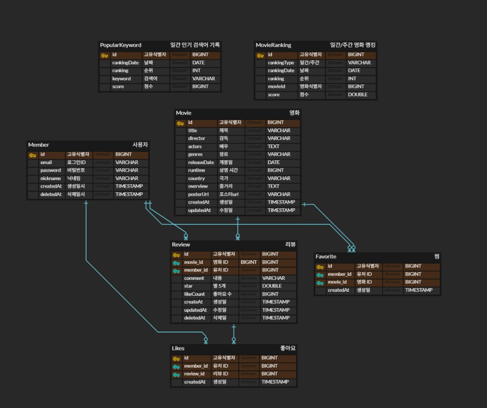
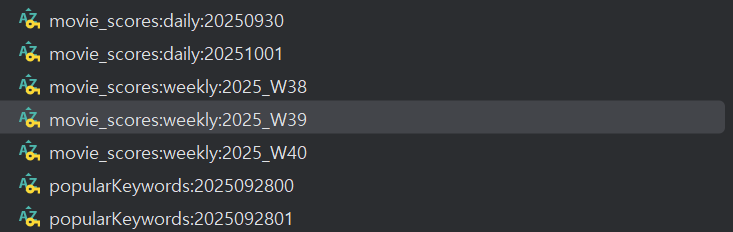
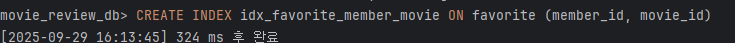
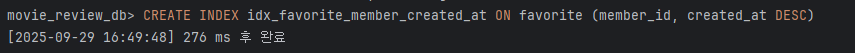
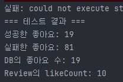
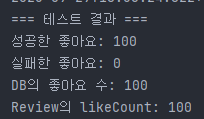

# 777 Pedia

> Cache, 동시성 제어에 집중한 영화 리뷰 서비스

<!-- TOC -->

- [777 Pedia](#777-pedia)
    - [1. 프로젝트 개요](#1-프로젝트-개요)
    - [2. ERD](#2-erd)
    - [3. 핵심 기능 설계 및 트러블 슈팅](#3-핵심-기능-설계-및-트러블-슈팅)
        - [3.1. 캐싱(Caching)](#31-캐싱caching)
        - [3.2. 최적화(Indexing)](#32-최적화indexing)
        - [3.3. 동시성 제어(Concurrency Control)](#33-동시성-제어concurrency-control)
    - [4. 캐시 과제 요구 사항 작성 내역](#4-캐시-과제-요구-사항-작성-내역)
        - [4.1. 필수 구현 기능](#41-필수-구현-기능)
        - [4.2. 선택 구현 기능](#42-선택-구현-기능)
        - [3. 심화 구현 기능](#3-심화-구현-기능)
    - [5. 주요 기능 및 API](#5-주요-기능-및-api)
        - [5.1. API 목록](#51-api-목록)
        - [5.2. Redis 백업 스케줄러](#52-redis-백업-스케줄러)
    - [6. 시연 영상](#6-시연-영상)
    - [7. 개발 환경](#7-개발-환경)
    - [8. Git 그라운드 룰](#8-git-그라운드-룰)
    - [9. 팀원](#9-팀원)

<!-- /TOC -->

## 1. 프로젝트 개요

- 검색 및 인기 검색어 기능이 존재하는 영화 “리뷰” 서비스
- Cache를 이용한 검색 및 랭킹 서비스 성능 개선
- 리뷰의 댓글 좋아요 기능에 대한 동시성 제어 및 인덱스를 이용한 최적화
- 검색 및 리뷰 등 에 리뷰에 필요한 기본적인 CRUD 및 JWT 인증 구현

## 2. ERD



- Redis Sorted Set은 핵심 기능 및 트러블 슈팅 - 캐싱 참조

## 3. 핵심 기능 설계 및 트러블 슈팅

### 3.1. 캐싱(Caching)

- **1. 목적**
    - **트래픽 집중 완화**: 인기 검색어, 영화 랭킹 목록 및 목록에 해당하는 검색 결과, 영화 등 **반복 조회**가 예상되는 기능에 캐시를 적용하여 **DB 부하 감소**
    - **응답 속도 향상**: 요청을 DB보다 훨씬 빠른 **메모리(Redis)에서 직접 처리**하여 응답 속도 개선
    - **안정성 및 확장성 확보**: 여러 서버가 Redis라는 **하나의 캐시 데이터를 공유**하는 상황을 가정하여, Scale-out 시에도 데이터 일관성 유지 용이
    - **부가적 이용**: 인기 검색어, 영화 랭킹 등 실시간 집계성 랭킹 데이터를 주기적으로 RDBMS에 **백업**하여, 향후 통계, 분석 등 부가적인 목적인 위한 데이터로 활용
- **2. Redis를 이용한 캐시 내역**
    - **A. Redis Sorted Set 데이터**
        - **실시간으로 변하면서도 순서가 중요한 랭킹의 의미를 가지는 기능을** 구현하는 데 최적화되었다고 생각하여 선택
        - **자동 정렬**: 데이터와 score를 저장하면, score에 따른 오름차순 정렬까지 적용
        - **원자적 연산**: `ZINCRBY`(`incrementScore`) 명령어 하나로 특정 데이터의 점수를 '읽고-더하고-쓰는' 과정을 한 번에, 그리고 매우 안전하게 처리할 수 있음 → 메모리의
          힘!
        - **빠른 범위 조회**: `ZREVRANGE`(`reverseRange`)를 통해 Top 1, Top 10, Top 100 등 원하는 범위의 순위를 매우 빠르게 조회할 수 있음

      

      | 데이터 종류 | Redis Key 형식 | Value (멤버) | Score (점수) | 핵심 역할 | expired |
              | --- | --- | --- | --- | --- | --- |
      | **실시간 인기 검색어 집계** | popularKeywords:{yyyyMMddHH} | 검색 키워드 (예: "영웅", 마동석, 봉준호 등) | 검색 API의 Request Parameter로 사용되어 호출되면 +1 | 시간 단위로 어떤 단어가 얼마나 많이 검색되었는지 실시간으로 집계합니다. | 48시간 |
      | **실시간 영화 랭킹 집계** | movie_scores:daily:{yyyyMMdd}/  <br>movie_scores:weekly:{yyyy_Www} | 영화 ID (예: "101") | 인기도 점수  <br>(리뷰 추가+1, 좋아요 추가+0.5) | 일간/주간 단위로 어떤 영화의 인기도 점수가 가장 높은지 실시간으로 집계합니다. | 48시간/8일 |
        - 매일 새벽 4시에 실시간 인기 검색어와 일간 영화 Top 10, 매주 월요일 새벽 4시에 주간 영화 Top 10은 `@Scheduled`을 가 있는 메서드를 통해 RDBMS로의 백업이 이뤄지도록
          구현
        - 백업 중 오류 발생을 대비하여 `expired`기간에 여유 기간을 더해서 정함

    - **B. API별 캐싱 전략 및 효과 정리**
        - **1. 영화 검색 API (`GET /api/v2/search`)**
            - **캐시 전략**: **조건부 캐싱**
                - 검색어가 **'현재' 또는 '과거' 인기 검색어 Top 10**에 포함될 경우에만, 검색 결과를 Redis에 캐싱
            - **기대 효과**
                - **DB 부하 집중 완화 및 Redis 효율 제고:** 모든 검색 결과를 캐싱하는 것은 **비효율적+사실상 불가능**이므로, 조회수가 집중될 것으로 예상되는 **'인기 검색어'**에
                  대한 결과만 캐싱
                - **유연한 TTL**
                    - **'현재'** 인기 검색어의 결과(변동성 높음)는 **짧은 TTL(5분)**로, **'과거'** 인기 검색어의 결과(안정적)는 **긴 TTL(2시간)**로 설정
                    - 인기 검색어 기능이 지난 1시간 단위로 유지되기 때문에 ‘과거’ 인기 검색결과는 넉넉하게 길게 설정
                    - ‘현재’ 인기 검색 결과는 캐시 히트율에 대한 불확실성이 높으나, 트래픽이 집중되는 현상을 위해 짧게 운영 → 신중 필요
        - **2. 인기 검색어 Top 10 목록 조회 API (`GET /api/v1/search/popular`)**
            - **캐시 전략**: **API 응답 캐싱**
                - '이전 시간대'의 Top 10 목록은 **한 시간 동안 변하지 않는 고정(Immutable) 데이터**
                - 메인 페이지에 노출되는 만큼 목록 조회도 요청 수가 많다고 판단하여 도입
            - **기대 효과**
                - **Redis 부하 최소화**: API가 호출될 때마다 Redis의 Sorted Set을 조회하여 순위를 계산하는 과정조차 생략하고, 캐시에서 즉시 완성된 목록을 반환하여 응답 속도를
                  극대화
        - **3. 영화 랭킹 Top 10 목록 API (`GET /api/v1/movies/ranking?period=`)**
            - **캐시 전략**: **API 응답 캐싱**
                - '어제'의 일간 Top 10과 '지난주'의 주간 Top 10 목록은 각각 **하루, 일주일 동안 변하지 않는 고정 데이터**
                - 메인 페이지에 노출되는 만큼 목록 조회도 요청 수가 많다고 판단
            - **기대 효과**
                - **DB 부하 최소화**: 랭킹 목록을 조회할 때마다 발생하는 반복적인 DB 조회(영화 상세 정보)와 Redis 조회(ID 목록)를 차단
        - **4. 영화 상세 정보 조회 API (`GET /api/v1/movies/{movieId}`)**
            - **캐시 전략**: **조건부 캐싱**
                - 조회하려는 영화가 **'일간' 또는 '주간' Top 10 목록에 포함**될 경우에만, 해당 영화의 상세 정보를 Redis에 **8일** 동안 캐싱
            - **기대 효과**
                - **DB 부하 집중 완화 및 Redis 효율 제고**: 모든 영화가 아닌, **반복적으로 조회될 확률이 매우 높은 '인기 영화**'의 상세 정보만 캐싱
                - 일간/주간 영화의 중복 가능성을 고려하여 캐시를 통합하고 긴 TTL을 적용함으로써 캐시 효율을 높임
    - **C. 전체 캐시 내역**

        |  | **캐시 대상** | **TTL (유효 기간)** | **데이터 특성** | **전략 및 근거** |
        | --- | --- | --- | --- | --- |
        | 1 | **인기 검색어 목록 조회 (API)** | 1시간 | 불변 | **인기 검색어 목록** 조회 API 응답 자체를 캐싱<br>→**4시 5분 일 경우 3~4시 사이의 인기 검색어 반환** |
        | 2 | **‘과거' 인기 검색어의 검색 결과 (API)** | 2시간 | 불변 | 인기 검색어 목록 조회 API의 결과의 **키워드 자체에 대한 검색 결과 캐싱 <br>검색 API의 캐시 컨디션**으로 사용됨<br> → 1시간 동안 유지되는 목록의 키워드에 대한 검색 결과 이므로 TTL을 넉넉하게 2시간으로 설정 |
        | 3 | **‘현재' 인기 검색어의 검색 결과** | 5분 | 변동 | 1시간 단위의 인기 검색어만 제공하므로 목록 자체가 외부로 공개되지는 않음<br>**검색 API의 캐시 컨디션**으로 사용됨<br>→ 시간이 지나고 더 이상 쌓이지 않으면 고정 데이터가 됨<br>→ 이것을 토대로 1번 인기 검색어 목록을 만들게 됨<br>→ 캐시 히트율에 대한 불확실성이 높음, 트래픽 집중 현상 방어를 위해 짧은 TTL로 운영<br>**→ 실제 운영환경에선 신중하게 결정해야 할 것이라고 생각함** |
        | 4 | **주간 영화 Top 10 목록 (API)** | 7일 | 불변 | 지난 주 영화 Top 10 **목록** 조회 API의 응답을 캐싱<br>→ ‘지난주'의 고정된 데이터를 일주일 캐싱하여 안정적인 서비스 및 캐시 히트율 극대화 |
        | 5 | **일간 영화 Top 10 목록 (API)** | 24시간 | 불변 | 지난 주 영화 Top 10 **목록** 조회 API의 응답을 캐싱<br>→ ’어제'의 고정된 데이터를 하루 캐싱하여 안정적인 서비스 및 캐시 히트율 극대화. |
        | 6 | **Top 10 영화 상세 정보 (API)** | 8일 | 불변 | **일간/주간 영화 Top 10 목록에 있는 영화 정보**에 대한 캐싱<br>→일간/주간 Top 10 **영화의 중복 가능성이 높으므로, 단일 캐시로 통합**하고 더 긴 주간 TTL(8일)을 적용하여 DB 부하 최소화. |
        
        - 캐시가 API 호출에 대한 불변 DTO 응답에 사용되었기 때문에, 빠른 `JSON` 변환을 위해 `String`으로 저장
        - 캐시 내역을 `Enum`으로 관리하여 사용

- **3. 캐시 적용 예시**
    - **시나리오 1: '일간 Top 10 영화' 목록 조회** (`GET /api/v1/movies/ranking?period=daily`)
        1. **API 호출**
            - 사용자가 일간 Top 10 영화 목록 확인을 위해 `GET /api/v1/movies/ranking?period=daily`를 요청합니다.
        2. **`@Cacheable` 조건 검사**:
            - `movieRankingService.getDailyTop10()`이 호출되어`@Cacheable(cacheNames = "dailyTop10Movies", ...)` 어노테이션이 동작하여
              Redis 캐시를 먼저 확인합니다.
        3. **캐시 확인**
            - **Cache Hit**: Redis의 `dailyTop10Movies` 캐시에 '어제' 날짜의 랭킹 목록이 있으면, **DB 조회 없이 Redis에서 즉시 결과를 반환**
            - **Cache Miss**:
                1. Redis의 **Sorted Set**에서 어제자 영화 랭킹 ID 목록(`[101, 105, ...]`)을 조회.
                2. 조회된 ID 목록으로 DB에서 영화 정보를 가져옴.
                3. 가져온 `Movie` 엔티티와 순위 정보를 조합하여 DTO를 생성.
                4. 생성된 DTO 리스트를 **`dailyTop10Movies` 캐시에 24시간짜리 TTL로 저장**한 후, Controller에 반환
                5. **TTL 만료 전까지 ‘어제’ 날짜의 Top 10 영화 목록은 캐시를 통해 제공되어 성능 향상**
    - **시나리오 2: 1과 연계된 '일간 Top 10 영화' 상세 정보 조회** (`GET /api/v1/movies/{movieId}`)
        1. **API 호출**: 사용자가 Top 10 목록의 영화(예: `movieId=101`)를 클릭합니다.
        2. **`@Cacheable` 조건 검사**: `MovieService`는 이 영화가 **'일간' 또는 '주간' Top 10**에 포함되는지 `MovieRankingService`를 통해
           확인합니다. → `Redis Sorted Set`을 조회
        3. **캐시 확인**:
            - **조건 만족 시**: `movieDetailsTop10` 캐시에서 `key=101`에 해당하는 데이터가 있는지 확인합니다.
                - **Cache Hit**: Redis에서 즉시 상세 정보를 반환합니다. **(DB 접근 X)**
                - **Cache Miss**: DB에서 상세 정보를 조회하고, 그 결과를 **8일짜리 TTL로 캐시에 저장**한 후 반환합니다.
            - **조건 불만족 시**: 캐시 로직을 건너뛰고 **DB에서 직접 상세 정보**를 조회합니다.
- **4. 향후 개선 방안**
    1. `isDailyTop10` 등 Cache의 **Condition** 체크에 사용되는 메서드 호출 시 매번 Redis 접근
        - Redis가 아닌 Local Cache를 활용하여 용도에 따라 1차 캐시도 활용해보기
    2. **최초** Cache Miss 시 혹은 만료 시의 **캐시 스탬피드**같은 동시 다발 요청 방어를 위해 `@Cacheable(sync=true)` 외의 다중 인스턴스에서의 방법 고려
    3. 실제 운영 상에서는 Cache hit, Cache miss 데이터와 비즈니스 계획에 따라 Cache 전략 수정

### 3.2. 최적화(Indexing)

- 전체 테이블 인덱스 수동 적용 내역
    - Favorite 도메인 인덱스 쿼리
        - `CREATE INDEX idx_favorite_member_movie ON favorite (member_id, movie_id);`
        - `CREATE INDEX idx_favorite_member_created_at ON favorite (member_id, created_at DESC);`
    - Like 도메인 인덱스 쿼리
        - `CREATE UNIQUE INDEX idx_likes_member_review ON likes(member_id, review_id);`
        - `CREATE INDEX idx_likes_member_created ON likes(member_id, created_at DESC);`
    - Movie 도메인 인덱스 쿼리
        - `CREATE INDEX idx_movie_release_date ON movie (release_date);`
        - `CREATE INDEX idx_ranking_type_and_date ON movie_ranking (ranking_type, ranking_date)`
    - Search 도메인 인덱스 쿼리
        - `CREATE INDEX idx_popular_ranking_date ON popular_keyword (ranking_date)`
- 사용자의 찜 추가 및 제거
    - **개선 대상 쿼리와 선택 이유**
        - SQL

        ```sql
        SELECT *
        FROM favorite
        WHERE member_id = ? AND movie_id = ?;
        ```

        - 찜 추가 시 이미 찜한 영화인지 확인할 때 호출
        - 찜 제거 시 삭제할 찜 정보를 조회할 때 호출
        - JPA Repository 메서드
            - `Optional<Favorite> findByMemberIdAndMovieId(Long memberId, Long movieId);`
        - 선택 이유
            - 사용자가 영화를 찜 추가할 때나 제거할 때 항상 실행되는 쿼리
            - `favorite` 테이블의 데이터가 엄청나게 많아질 경우, 인덱스 없이 모든 튜플을 확인하는 풀스캔이 발생 → 속도가 매우 느려짐. (시간 복잡도 O(n))

        ---

    - **인덱스 설정 DDL 쿼리**
        - 인덱스 생성 쿼리 (멀티 컬럼 인덱스)

        ```sql
        CREATE INDEX idx_favorite_member_movie ON favorite (member_id, movie_id);
        ```

        - `member_id` 와 `movie_id` 를 함께 조회하는 쿼리의 성능을 향상

        ---

    - **쿼리 속도 비교 (Before, After)**
        - `EXPLAIN` 명령어를 통해 실행 계획, 인덱스를 확인
        - **인덱스 생성 전 (Before)**
            - `EXPLAIN SELECT * FROM favorite WHERE member_id = 18 AND movie_id = 1;`

          | id | select_type | table | partitions | type | possible_keys | key | key_len | ref | rows | filtered | Extra |
                      | --- | --- | --- | --- | --- | --- | --- | --- | --- | --- | --- | --- |
          | 1 | SIMPLE | favorite |  | ref | FK5w3q9ljpthkixo71hetx3ired,FK728jcsp8okxo8km8tly6q8lku | FK728jcsp8okxo8km8tly6q8lku | 9 | const | 5 | 2.06 | Using where |
            - type: ref (인덱스 사용)
            - key: `FK728jcsp8okxo8km8tly6q8lku` (movie_id)  옵티마이저가 인덱스 자동 선택
            - rows: 5개의 행을 스캔했다고 예측
            - Extra: Using where
        - **인덱스 생성 후 (After)**
            - `CREATE INDEX idx_favorite_member_movie ON favorite (member_id, movie_id);`

          

            - `EXPLAIN SELECT * FROM favorite WHERE member_id = 18 AND movie_id = 1;`

          | id | select_type | table | partitions | type | possible_keys | key | key_len | ref | rows | filtered | Extra |
                      | --- | --- | --- | --- | --- | --- | --- | --- | --- | --- | --- | --- |
          | 1 | SIMPLE | favorite |  | ref | FK728jcsp8okxo8km8tly6q8lku,idx_favorite_member_movie | idx_favorite_member_movie | 18 | const,const | 1 | 100 |  |
            - type: ref (인덱스 사용)
            - key: `idx_favorite_member_movie` (복합 인덱스 사용)
            - rows: 1개의 행만 정확히 스캔
            - Extra: null
                - Using where 제거

      ### 쿼리 실행 시간

        - **인덱스 생성 전 (Before)**: 약 0.0035초
        - **인덱스 생성 후 (After)**: 약 0.0005초
            - **개선 효과**: 멀티 컬럼 인덱스를 사용하여 스캔하는 행의 수를 크게 줄여 쿼리 실행 시간이 약 85% 단축되었습니다.

- 사용자의 찜한 영화 목록 페이지 조회 (최신순 정렬)
    - **개선 대상 쿼리와 선택 이유**
        - SQL

        ```sql
        SELECT *
        FROM favorite
        WHERE member_id = ?
        ORDER BY created_at DESC;
        ```

        - 사용자가 찜한 영화 목록을 최신순으로 보여줄 때 호출
        - `getMyFavorites` 컨트롤러 메서드에서 `Sort.*by*("createdAt").descending();` 사용
        - JPA Repository 메서드
            - `Page<Favorite> findByMemberId(Long memberId, Pageable pageable);`
        - 선택 이유
            - 찜한 영화가 수백, 수천 개로 많아질 경우 ORDER BY 작업에서 큰 성능 부하가 발생
            - 필터링 된 많은 데이터를 디스크에서 별도로 정렬하는 `Using filesort` 가 발생

        ---

    - **인덱스 설정 DDL 쿼리**
        - 인덱스 생성 쿼리 (멀티 컬럼 인덱스)

        ```sql
        CREATE INDEX idx_favorite_member_created_at ON favorite (member_id, created_at DESC);
        ```

        - `member_id`로 데이터를 먼저 찾고, 찾아진 결과를 `created_at` 기준으로 정렬하여 `filesort` 작업을 제거

        ---

    - **쿼리 속도 비교 (Before, After)**
        - `EXPLAIN` 명령어를 통해 실행 계획, 인덱스를 확인
        - **인덱스 생성 전 (Before)**
            - `EXPLAIN SELECT * FROM favorite WHERE member_id = 18 ORDER BY created_at DESC;`

          | id | select_type | table | partitions | type | possible_keys | key | key_len | ref | rows | filtered | Extra |
                      | --- | --- | --- | --- | --- | --- | --- | --- | --- | --- | --- | --- |
          | 1 | SIMPLE | favorite |  | ref | idx_favorite_member_movie | idx_favorite_member_movie | 9 | const | 9246 | 100 | Using filesort |
            - type: ref (member_id 외래 키 인덱스 사용)
            - key: `idx_favorite_member_movie` (member_id)
                - 옵티마이저가 이전에 만들었던 멀티 인덱스를 선택
            - rows: 9246개의 행을 스캔했다고 예측
            - Extra: Using filesort
                - 현재 선택된 인덱스가 `created_at` 정렬 정보를 가지고 있지 않다.
                - MySQL은 9246개의 데이터를 다시 created_at 기준으로 정렬하기 위해 filesort 추가 작업 수행
        - **인덱스 생성 후 (After)**
            - `CREATE INDEX idx_favorite_member_created_at ON favorite (member_id, created_at DESC);`

          

            - `EXPLAIN SELECT * FROM favorite WHERE member_id = 18 ORDER BY created_at DESC;`

          | id | select_type | table | partitions | type | possible_keys | key | key_len | ref | rows | filtered | Extra |
                      | --- | --- | --- | --- | --- | --- | --- | --- | --- | --- | --- | --- |
          | 1 | SIMPLE | favorite |  | ref | idx_favorite_member_movie,idx_favorite_member_created_at | idx_favorite_member_created_at | 9 | const | 9246 | 100 |  |
            - key: `idx_favorite_member_created_at` (WHERE과 ORDER BY 를 지원하는 인덱스)
            - Extra: null (Using filesort 제거)
                - 이미 정렬된 상태로 데이터를 가져오므로 추가 정렬 작업이 필요없으므로 Using filesort가 제거

          ###  

        ### 쿼리 실행 시간
        
        - **인덱스 생성 전 (Before)**: 약 0.0120초
        - **인덱스 생성 후 (After)**: 약 0.0010초
            - **개선 효과**: 인덱스를 추가하여 `Using filesort`를 제거함으로써 쿼리 실행 시간이 약 91% 단축되었습니다.

- 검색 API 쿼리 구조 변경 및 releaseDate 인덱스 추가
    - **개요**
        - `movie` 테이블(100만 건)의 `title`, `director`, `actors` 컬럼에 대한 **LIKE '%keyword%'**의 성능을 개선
    - **테스트 환경**
        - DB: `movie` 테이블 약 100만 건
            - actors는 간편 설계로 인해 이름1, 이름2, 이름3 처럼 쉼표로 구분된 형태
        - 테스트 방식: `@SpringBootTest`를 이용한 서비스 레벨 실행 시간 측정
        - 시행 횟수: Warm-up 3회를 제외하고, 10회 반복 실행한 결과의 평균값
    - **테스트 결과**

  | 단계 | 적용된 기술 및 전략 | 평균 실행 시간 | 성능 변화 (Baseline 대비) |
      | --- | --- | --- | --- |
  | **A. Baseline** | `JOIN` + `GROUP BY` + `%LIKE%` + `ORDER BY` | **2478.4 ms** | - |
  | **B. 구조 변경** | **서브쿼리** + `%LIKE%` + `ORDER BY` | **720.0 ms** | **약 3.4배 향상** |
  | **C. 구조 변경 + 인덱스** | 서브쿼리 + `%LIKE%` + `ORDER BY` + **`release_date` 인덱스** | **368.7 ms** | **약 6.7배 향상** |
    - 분석
        1. **Baseline (2478.4 ms)**: 복잡한 `JOIN` 구조와 `%LIKE%` 검색, 그리고 대규모 데이터 정렬로 인해서 **약 2.5초**의 매우 느린 응답 속도를 보였습니다.
        2. **구조 변경 (720.0 ms)**: 쿼리 구조를 `JOIN`에서 **서브쿼리**로 변경하자, 무거운 `JOIN`과 `GROUP BY`의 병목이 사라져 성능이 **약 3.4배 향상**되었습니다.
           하지만 여전히 정렬 작업으로 인해 720ms의 시간이 소요되었습니다.
        3. **구조 변경 + 인덱스 (368.7 ms)**: 서브쿼리 구조에 **`release_date` 인덱스**를 추가하자, DB 옵티마이저가 인덱스를 활용하여 비효율적인 정렬을 피하게 되었습니다. 그
           결과 실행 시간이 **다시 절반으로 줄어들어** 최종적으로 Baseline 대비 **약 6.7배의 성능 향상**을 달성했습니다.

### 3.3. 동시성 제어(Concurrency Control)

- **각 락을 설정하는 방법과 장단점**
    - 낙관적 락(Optimistic Lock)
        - 구현 방식

            ```java
            @Entity
            public class Review extends BaseTimeEntity {
            
                @Version
                private Long version;
            
                // ... 등등
            }
            ```

        - 동작 방식

            <aside>

            1. 트랜잭션 A가 `reviewId=1` 인 리뷰(`version=1`)를 조회한다.
            2. 트랜잭션 B도 동시에 `reviewId=1`인 리뷰(`version=1`)를 조회한다.
            3. 트랜잭션 B가 먼저 좋아요 로직을 처리하고 커밋하면 이때 DB의 리뷰 버전은 2로 증가한다.
            4. 트랜잭션 A가 그 뒤에 로직을 처리하고 커밋을 시도하면 자신이 읽은 버전(1)과 DB의 버전(2)이 다른 것을 확인한다.
            5. 버전이 일치하지 않아 `OptimisticLockException` 을 발생시키고 트랜잭션 A의 변경사항은 롤백시킨다.
            6. 개발자는 이 예외를 catch 하거나, 정해진 횟수만큼 재시도하는 로직을 구현해야 한다.
            </aside>

        - 장점
            - 성능이 좋다(락을 사용하지 않음)
            - 충돌이 적은 환경에서 효율적
        - 단점
            - 충돌 발생 시 트랜잭션 재시도로 성능 저하 가능
            - 재시도를 위한 로직이 추가되면서 유지보수 및 코드 난이도가 올라감
    - 비관적 락(Pessimistic Lock)
        - 데이터에 접근할 때부터 락을 걸어 다른 트랜잭션의 수정을 막는 방식
        - 충돌이 자주 발생할 것이라고 비관적으로 가정하는 방식
        - 구현 방식

            ```java
                @Lock(LockModeType.PESSIMISTIC_WRITE)
                @Query("select r from Review r where r.id = :reviewId")
                Optional<Review> findByIdForUpdate(@Param("reviewId") Long id);
            ```

        - 동작 방식

            <aside>

            1. 트랜잭션 A가 `reviewId=1` 인 리뷰의 좋아요 수를 증가시키기 위해 데이터 조회
            2. 이때 DB는 해당 데이터 행에 Exclusive Lock을 건다.
            3. 트랜잭션 B가 동시에 이 데이터에 접근하여 수정하려고 하면, 락이 걸려져있으므로 대기 상태가 된다.
            4. 트랜잭션 A가 로직을 모두 수행하고 커밋 후에 DB는 해당 행의 락을 해제한다.
            5. 트랜잭션 B가 락을 획득하여 작업을 수행할 수 있다.
            </aside>

        - 장점
            - 데이터 정합성 유지
            - 구현이 간단함
            - 갱신 손실, 쓰기 스큐와 같은 동시성 문제를 확실히 해결 가능
        - 단점
            - 성능이 저하
            - 데드락에 빠질 가능성이 있다.
    - 분산 락(Distributed Lock)  ✅
        - 분산된 서버에서 공유자원에 동시에 접근 시 발생할 수 있는 문제를 제어하기 위해 사용되는 방식
        - Lock에 대한 정보를 분산된 서버가 접근 가능한 공통적인 저장소에 저장하고 분산 서버들은 저장된 Lock을 보고 접근 여부를 판단
        - 구현 방식

            ```java
            @RequiredArgsConstructor
            @Service
            public class LikeService {
                private final RedissonClient redissonClient;
            
                public LikeResponse addLike(Long memberId, Long reviewId) {
                    RLock lock = redissonClient.getLock("review:" + reviewId + ":lock");
                    try {
                        // 락 획득 시도 (최대 10초 대기, 락 점유는 1초)
                        boolean available = lock.tryLock(10, 1, TimeUnit.SECONDS);
                        if (!available) {
                            throw new BusinessException("락 획득 실패");
                        }
            
                        likeTransactionService.incrementLike(reviewId);
            
                    } catch (InterruptedException e) {
                        Thread.currentThread().interrupt();
                        throw new RuntimeException(e);
                    } finally {
                        // 락 해제
                        if (lock.isLocked() && lock.isHeldByCurrentThread()) {
                            lock.unlock();
                        }
                    }
                    // ...
                }
            }
            ```

        - 동작 방식

            <aside>

            1. 락 획득 시도: 서버 A가 `review:1:lock`이라는 키로 락 획득을 시도. Redisson은 내부적으로 Lua 스크립트를 사용하여 원자적으로 Redis에 락 정보를 기록함.
            2. 락 획득 성공: 락 정보가 성공적으로 기록되면, 서버 A는 임계 영역의 로직을 수행. 이때 Watchdog이라는 메커니즘이 동작하여, 작업이 길어질 경우 락의 만료 시간을 자동으로
               연장한다.
            3. 락 획득 실패: 만약 다른 서버 B가 이미 락을 점유 중이라면, 서버 A는 락 획득에 실패. 이때 무작정 재시도하는 것이 아니라, Redisson의 Pub/Sub 기능을 통해 락이
               해제되었다는 메시지가 올 때까지 효율적으로 대기합니다.
            4. 락 해제: 서버 A가 작업을 마치면 락을 해제하고, Pub/Sub을 통해 대기 중인 다른 서버에게 락이 해제되었음을 알립니다.
            </aside>

        - 장점
            - 분산 환경에서 완벽한 동시성 제어
            - Redisson과 같은 라이브러리를 사용하면 Watchdog(락 자동 연장), Pub/Sub 기반 대기 등 복잡한 기능들을 편리하게 사용
        - 단점
            - 구현 복잡도가 높고, 외부 시스템 관리 포인트가 추가
            - Redis와 같은 별도의 외부 시스템에 대한 의존성이 생김
- **최종 방안을 선택한 이유**
    - 애플케이션 서버가 다중 인스턴스로 확장되는 환경에서는 단일 DB에 걸린 비관적 락이나 낙관적 락만으로는 서버 간 동시성 제어가 되지 않음
    - Redis를 이용한 분산락은 프로세스와 서버 인스턴스를 통해 자원 접근을 직렬화 할 수 있어 여러 서버에서 동시에 “좋아요” 요청이 들어와도 정합성을 보장할 수 있음
    - DB에 락을 거는 것 보다 부하를 줄일 수 있고 빠른 응답성과 확장성을 확보할 수 있다 판단
- **분산 락을 이용한 동시성 문제 테스트 결과 비교**
    - 동시성 문제 해결 전

      

    - 동시성 문제 해결 후

      

## 4. 캐시 과제 요구 사항 작성 내역

### 4.1. 필수 구현 기능

- **왜 검색 API 에 Cache 를 적용했는지 스스로 꼭!! 고민하고 Readme 작성.**
    - 반복적인 DB 조회가 많이 일어나는 부분에 Cache를 적용하여 응답 속도는 향상시키고, DB 부하는 감소시키는 효과를 얻기 위해서 적용했습니다.
    - 캐시별 적용 이유는 [**여기**](https://www.notion.so/README-md-27f255060e6780c8a570e7da480b9993?pvs=21)를 참조하세요.

### 4.2. 선택 구현 기능

- **Remote Cache 를 위한 다양한 라이브러리(Memcached 등) 들이 있을텐데 그 중에서 Redis 를 선택한 이유가 무엇일까?**
    - 인기 검색어, Top 10 등 랭킹의 의미를 가지는 문제를 구현하는데 효율적
        - SortedSet(ZSET) 자료구조를 이용하면 원자적 연산을 하는 ZINCRBY(incrementScore) 명령어로 해결이 가능함 무려, 자료구조만 사용해도 해결이 가능함!!
            - 특정 항목의 점수를 올리고, 자동으로 재정렬이 매우 빠르게 처리됨
        - Redisson같은 라이브러리를 이용하면 분산 락을 쉽고 안정적으로 구현할 수 있음
        - 데이터 백업을 위한 옵션 존재
- **Redis Cache 에 데이터를 저장할 때 사용한 자료구조는 무엇이고, 다양한 자료구조중에 해당 자료구조를 선택한 이유는 무엇일까?**

  ### **1. Sorted Set**

    - **사용한 기능**
        - **실시간 인기 검색어 집계** (`popularKeywords:{yyyyMMddHH}`)
        - **일간/주간 영화 Top 10 랭킹 집계** (`movie_scores:daily:...`, `movie_scores:weekly:...`)
    - **선택한 이유**
        - **실시간으로 변하면서도 랭킹의 의미를 가지는 기능을** 구현하는 데 최적화되었다고 생각하여 선택
        - **자동 정렬**: 데이터를 추가할 때 score를 함께 저장하면, Redis가 항상 정렬을 해줌
        - **원자적 연산**: `ZINCRBY`(`incrementScore`) 명령어 하나로 특정 데이터의 점수를 '읽고-더하고-쓰는' 과정을 한 번에, 그리고 매우 안전하게(atomic) 처리할 수
          있음 → 메모리의 힘?
        - **빠른 범위 조회**: `ZREVRANGE`(`reverseRange`)를 통해 Top 1, Top 10, Top 100 등 원하는 범위의 순위를 매우 빠르게 조회할 수 있음

  ### 2. String

    - **사용한 기능**
        - **API 응답 캐싱**: `@Cacheable`을 통해 저장되는 모든 데이터.
            - 인기 검색어의 **검색 결과** (`movieSearchCurrentPopular`, `movieSearchPrevPopular`)
            - 인기 검색어 / Top 10 **목록 API의 응답** (`popularKeywords`, `dailyTop10Movies`, `weeklyTop10Movies`)
            - Top 10 영화의 **상세 정보** (`movieDetailsTop10`)
    - **선택한 이유**
        - **완성된 객체나 API 응답 전체를 그대로 저장**하고 꺼내 쓰는 데 단순하고 효율적이라서 선택
        - **범용성**: `GenericJackson2JsonRedisSerializer`를 통해 `PageResponse`, `List<MovieRankResponse>`, `Movie` 등 어떤 Java
          객체든 **JSON 문자열**로 변환하여 저장할 수 있음
        - **단순함**: 복잡한 로직 없이, `GET(key)`과 `SET(key, value)` 두 가지 기본 명령어로 데이터를 통째로 읽고 쓸 수 있음 → API 응답처럼 한번 만들어지면 내용이 바뀌지
          않는 데이터를 캐싱하는 데 적합

- Redis 는 대표적인 Key-Value 형태로 데이터를 저장하는 대표적인 NoSQL 저장소다.
  **그렇다면 RDBMS(SQL) 와 NoSQL 의 차이점은 무엇일까?**
    - 가장 큰 차이는 데이터를 저장하는 방식이다.
        - RDBMS는 관계를 기본으로 데이터를 표현하기 때문에 정해진 스키마에 따라 데이터를 테이블 형태로 저장한다. 따라서 각 행이 동일한 열의 구조를 가지게 되는 고정적인 형식의 데이터로 저장한다.
        - NoSQL은 이름 그대로, 스키마에 집작하지 않고 원하는 모든 방식으로 데이터를 저장할 수 있다. 대표적으로 레디스처럼 key-value 형태나, document 등 다양한 형태로 데이터를 저장하고
          관리할 수 있다.

      | 구분 | RDBMS (SQL) | NoSQL |
              | --- | --- | --- |
      | 데이터 구조 | 엄격한 스키마 (테이블) | 유연한 스키마 (Key-Value, Document 등) |
      | 핵심 가치 | 데이터 정합성, 안정성 | 성능, 확장성, 유연성 |
      | 확장 방식 | 주로 스케일 업 (수직 확장) | 주로 스케일 아웃 (수평 확장) |
      | 적합한 상황 | 금융, 예약 등 데이터 일관성이 매우 중요한 서비스 | 대규모 SNS, 실시간 랭킹 서비스 등 |

- **Redis Cache 를 적용한 검색 API 에 대해서 v1, v2 API 각각 성능테스트 (nGrinder)**
    - 상세
      결과는 [Wiki](https://github.com/777-pedia/777-pedia/wiki/%EA%B2%80%EC%83%89-API-v1,-v2-%EC%BA%90%EC%8B%9C-%EC%84%B1%EB%8A%A5-%ED%85%8C%EC%8A%A4%ED%8A%B8)
      를 참고하세요
    - **결과 요약**
        - BaseLine

            | 구분 | v1 API (캐시 미적용) | **v2 API (캐시 적용)** | 성능 비교 |
            | --- | --- | --- | --- |
            | **평균 응답 속도**  | 389.21 ms | 5.12 ms | **약 76배 빠름** |
            | **최대 처리량 (최대 TPS)** | 4.5 | 336 | **약 75배 높음** |
            | **평균 처리량 (평균 TPS)** | 2.7 | 203.8 | **약 75배 높음** |
            | **총 성공 테스트** | 152 | 11,826 | **약 78배 많음** |
        - 부하 상황
            
            
            | 구분 | v1 API (캐시 미적용) | **v2 API (캐시 적용)** | 성능 비교 |
            | --- | --- | --- | --- |
            | **평균 응답 속도**  | 6,365 ms | 30.37 ms | **약 210배 빠름** |
            | **최대 처리량 (최대 TPS)** | 26 | 1,522.5 | **약 58배 높음** |
            | **평균 처리량 (평균 TPS)** | 14.5 | 246.1 | **약 17배 높음** |
            | 총 성공 테스트 | 1,683 | 8,993 | **약 5배 많음** |
        - 성능 테스트를 통해, **조건부 Redis 캐시를 적용한 v2 API가 v1 API에 비해 응답 속도와 처리량 측면에서 압도적으로 우수함**을 확인할 수 있엇다. 특히 응답 속도는 부하 상황에서 격차가 더 커졌다.
        - 캐시 도입은 DB의 부하를 주면서도, 시스템은 동일한 하드웨어 자원으로 부하 상황에서 **17배 더 많은 트래픽**을 감당할 수 있었다.
        - 같은 자원 상황에서 처리량을 늘리려면 코드 레벨에서 병목을 발생하는 부분이 있는지 확인하고 개선해야 할 것이다.
        - 그리고 서버와 DB에서 튜닝할 수 있는 부분을 튜닝 그리고 자원의 추가가 가능하다면 Scale-out 혹은 Scale-up을 고려해야 할 것이다.

### 3. 심화 구현 기능

- **Cache Eviction 을 이용해 캐시 데이터 동기화 문제 해결하기**
    - 현재 인기 검색어에 대한 캐싱을 5분으로 TTL을 짧게 설정하여 동기화에 대한 문제를 짧게 가져가도록 했습니다.
        - 나머지 캐시는 데이터가 형성되는 과정에는 sorted Set을 사용하기 때문에 변동성이 있더라도, 캐싱의 대상이 되는 순간부터는 모두 고정 데이터가 됩니다. 따라서 캐시 데이터의 변동이 일어나지
          않습니다.
    - 검색 그리고 캐싱의 주 대상이되는 영화의 정보가 수정되는 경우를 대비해서 Eviction을 적용하면 좋을 것이라고 생각했습니다.
        - 다만, **영화 “리뷰” 서비스에 초점을 맞추고, CRUD를 구성하다보니 영화를 나타내는 Movie 엔티티에 대한 수정 기능이 프로젝트 범위에 존재하지 않았습니다.**
        - 그래서 Movie 엔티티의 정합성을 위한 Eviction은 구현하지 않고, 대신 RDBMS로 현재 데이터를 보존하기 위한 백업 로직을 구현했습니다.
        - 다만, 향후 서비스가 확장되어 **사용자가 직접 영화 정보를 할 수 있는 기능이 추가**된다면, Eviction 정책이 필요할 것으로 생각합니다.

## 5. 주요 기능 및 API

### 5.1. API 목록

| **도메인**  | **기능**                | **Method** | **URI**                             |
|----------|-----------------------|------------|-------------------------------------|
| Movie    | 영화 상세 정보 조회           | GET        | /api/v1/movies/{movieId}            |
|          | 영화 일간/주간 Top 10 목록 조회 | GET        | /api/v1/movies/ranking?period=daily |
| Favorite | 영화 찜 추가               | POST       | /api/v1/movies/{movieId}/favorites  |
|          | 영화 찜 해제               | DELETE     | /api/v1/movies/{movieId}/favorites  |
|          | 찜한 영화 목록 조회           | GET        | /api/v1/movies/favorites            |
| Review   | 리뷰 작성                 | POST       | /api/v1/reviews                     |
|          | 리뷰 수정                 | PATCH      | /api/v1/reviews/{reviewId}          |
|          | 리뷰 삭제                 | DELETE     | /api/v1/reviews/{reviewId}          |
|          | 리뷰 목록 조회              | GET        | /api/v1/reviews                     |
| Like     | 리뷰 좋아요 추가             | POST       | /api/v1/reviews/{reviewId}/likes    |
|          | 리뷰 좋아요 해제             | DELETE     | /api/v1/reviews/{reviewId}/likes    |
|          | 좋아요한 리뷰 목록 조회         | GET        | /api/v1/reviews/likes               |
| Member   | 회원가입                  | POST       | /api/v1/signup                      |
|          | 로그인                   | POST       | /api/v1/login                       |
| Search   | 영화 검색 v1 (Cache 미적용)  | GET        | /api/v1/search?keyword=마동석          |
|          | 영화 검색 v2 (Cache 적용)   | GET        | /api/v2/search?keyword=마동석          |
|          | 인기 검색어 Top 10 목록 조회   | GET        | /api/v1/search/popular              |

- 공통 응답 사용

    ```json
    << 공통 응답 >>
    
    {
        "success": true,           // boolean
        "message": "성공 메시지",   // string
        "data": {},               // 실제 데이터 (null 가능)
        "timestamp": "2024-03-21T10:00:00Z"  // ISO 8601 형식
    }
    
    /api/v1/
    ```

### 5.2. Redis 백업 스케줄러

- **인기 검색어 백업 스케줄러** (`PopularKeywordScheduler`)
    - **목적**
        - Redis에 **시간 단위**로 쌓이는 실시간 인기 검색어 데이터를, **일일 단위**로 최종 집계하여 RDBMS(MySQL)에 **영구적으로 보관**하여 통계 및 비즈니스 등에 사용
    - **동작**
        1. 매일 새벽 4시에 `@Scheduled`에 의해 자동으로 실행
        2. Redis에서 '어제' 하루 동안의 모든 시간대별 인기 검색어 Sorted Set 키(`popularKeywords:20251001*`)를 검색
        3. `ZUNIONSTORE` 명령어를 사용하여 24시간치 데이터를 하나의 일일 종합 랭킹으로 합산
        4. 합산된 결과의 **Top 100** 순위를 RDBMS의 `popular_keywords` 테이블에 저장

   ---

- **영화 랭킹 백업 스케줄러** (`MovieRankingScheduler`)
    - **목적**
        - Redis에 **일간/주간 단위**로 쌓이는 실시간 영화 랭킹 데이터를 RDBMS에 **영구적으로 보관**하여, 과거 랭킹 데이터를 분석하거나 통계 및 비즈니스 등에 사용
        - API를 통해 사용자에게는 Top 10까지 공개되나, 내부적 활용을 위해 100위까지 저장
        - 영화 랭킹의 경우, 일간/주간 데이터가 겹치는 경우가 많으므로 공유해서 사용하되, 테이블의 컬럼으로 구분
    - **동작**
        1. **일간 백업**
            1. 매일 새벽 4시 10분에 `@Scheduled`에 의해 실행
            2. Redis의 '어제' 날짜 일간 랭킹 Sorted Set(`movie_scores:daily:...`)을 `reverseRangeWithScores` 명령어를 이용하여 100위까지 조회
            3. RDBMS의 `movie_rankings` 테이블에 저장
        2. **주간 백업**
            1. 매주 **월요일** 새벽 4시 20분에 `@Scheduled`에 의해 실행
            2. Redis의 주간 랭킹 Sorted Set(`movie_scores:weekly:...`)을 `reverseRangeWithScores` 명령어를 이용하여 100위까지 조회
            3. RDBMS의 `movie_rankings` 테이블에 저장

## 6. 시연 영상

[시연 영상 링크](https://drive.google.com/file/d/1gwccGyLZx26XlYNsviXxvPUDqQGFZmtT/view?usp=sharing)

## 7. 개발 환경

- Spring Boot, Java 17
- MySQL, Redis
- Spring Data JPA, QueryDSL
- Spring Cache, Spring Data Redis, Redisson
- Spring Security, JWT
- Gradle
- Junit 5, Testcontainers

## 8. Git 그라운드 룰

- **Git Branch Strategy**
    - **Git Flow**: main ← develop ← feat/{issue-number}
- **Commit Message Convention**

    ```markdown
    - feat: 기능 개발
    - refactor: 리팩토링
    - fix: 버그 수정
    - chore: 빌드 관련 파일 수정 등
    - docs: 문서 작성 또는 수정
    - test: 테스트 코드
    
    <타입>: <제목> 형식으로 작성
    ```

- **Pull Request Rules**
    - **자동 리뷰어 지정**: PR이 열리면 랜덤으로 1명의 리뷰어가 선정되도록 Github Actions 활용
    - **Approve 규칙**: 최소 1명 이상의 Approve가 있어야 Merge 가능
        - 코드 리뷰를 통해 품질 뿐만 아니라 전체 프로젝트 코드 및 도메인 이해도 상승
    - **Squash And Merge 사용:**
        - PR 제목에도 Git commit message Convention 준수
- **Project Management**
    - **이슈 기반 개발**: GitHub Issues 중심으로 관리하고, Projects(칸반 보드)와 연동하여 시각적으로 확인
    - Issue Label 및 Template 적극 활용

## 9. 팀원

| 이름      | 역할                   | Github                                |
|---------|----------------------|---------------------------------------|
| **이영래** | Favorite, 동시성 제어     | [링크](https://github.com/youngrae0317) |
| **박수현** | Like, 동시성 제어         | [링크](https://github.com/soo59599)     |
| **장태욱** | Review, 동시성 제어       | [링크](https://github.com/doldollee00)  |
| **김민지** | Member, Auth, 동시성 제어 | [링크](https://github.com/lby9906)      |
| **김필선** | Search, Movie, 캐시    | [링크](https://github.com/seonrizee)    |